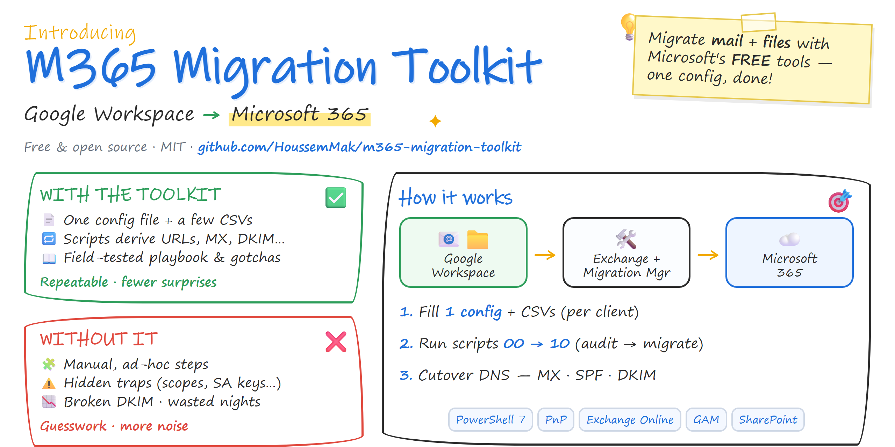
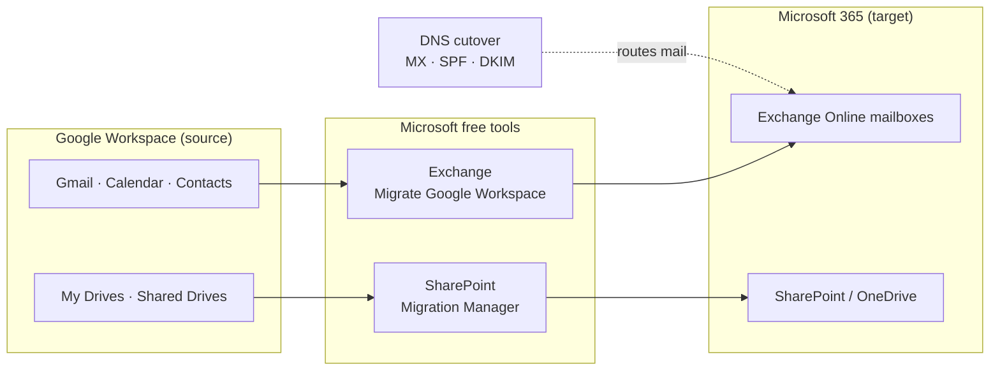

# M365 Migration Toolkit — Google Workspace → Microsoft 365

  

> Config-driven PowerShell toolkit to migrate a tenant from **Google Workspace** to **Microsoft 365** (mail + files) using **Microsoft's free native tools** — plus the hard-won gotchas nobody documents.

  
  
  
  

🇫🇷 **Version française :** [README.fr.md](README.fr.md) · Playbook complet : [METHODOLOGIE.md](METHODOLOGIE.md) (FR)

---

## Why this exists

Migrating from Google Workspace to Microsoft 365 with the **free** Microsoft tools (Exchange *"Migrate Google Workspace"* + SharePoint *Migration Manager*) is well within reach — but the path is littered with undocumented traps: org-policy blocks on service-account keys, missing OAuth scopes, the newer DKIM record format, archived Google accounts that silently break Drive scans, 400-character path limits, and more.

This toolkit turns a real migration into a **repeatable, config-driven process**: fill in **one config file + a few CSVs per client**, and the scripts derive every SharePoint/OneDrive URL, MX value and onmicrosoft address for you. The companion playbook captures **every trap encountered in production**, with the fix.

## Architecture

**Strategy:** pre-load everything while Google stays live, run incremental syncs, then flip DNS in a short cutover window.

## Features

- **Config-driven** — one `config/client-config.json` + `data/*.csv`; everything else is derived.
- **Mail**: audit → shared mailboxes → MRM/alias prep → endpoint → batches (pilot then waves).
- **Files**: SharePoint archive site + one library per Shared Drive, CSVs ready for Migration Manager, live progress probe.
- **Cutover**: computes exact MX/SPF and pulls the tenant's real DKIM CNAMEs.
- **Dashboard**: Excel workbook from your results CSVs.
- **Playbook** ([METHODOLOGIE.md](METHODOLOGIE.md)): what / why / how + "what changes per client" for every phase.

## Prerequisites

- **PowerShell 7+**, modules `PnP.PowerShell`, `ExchangeOnlineManagement`, `Microsoft.Graph.Authentication`.
- [**GAM7**](https://github.com/GAM-team/GAM) for the Google audit.
- **Excel** (dashboard) and a **browser** (interactive auth).
- **Super admin** on Google + **Global/Exchange/SharePoint admin** on M365 + **DNS** access.

## Quick start (per client)

1. **Config** — copy `config/client-config.example.json` → `config/client-config.json` and fill it in.
2. **Prereqs** — `pwsh scripts/00-Check-Prerequisites.ps1`
3. **Access** (once per client, see [METHODOLOGIE §3](METHODOLOGIE.md)):
   - `Register-PnPEntraIDAppForInteractiveLogin` → `pnpClientId`
   - `gam create project` + `gam oauth create` → service account (+ unblock org policies) → `serviceAccountEmail` / `KeyPath`
   - Domain-Wide Delegation with the provided scopes
4. **Audit** — `01-Audit-Google.ps1`, `02-Audit-M365.ps1` → fill `data/*.csv`.
5. **Target** — `03-Provision-SharePoint.ps1`, `04-Create-SharedMailboxes.ps1`, `05-Prep-Mailboxes.ps1`
6. **Mail** — `06-Create-MailEndpoint.ps1` → `07-Start-MailBatch.ps1` (pilot, then waves)
7. **Files** — Migration Manager (GUI) with the CSVs; track via `08-Probe-Migration.ps1`
8. **Cutover** — `09-Get-CutoverDnsValues.ps1` → DNS changes ([METHODOLOGIE §7](METHODOLOGIE.md))
9. **Dashboard** — fill `data/results-*.csv` → `10-Build-Dashboard.ps1`

## Scripts

| Script | Purpose |
|---|---|
| `_Config.ps1` | Loads config + derives all values |
| `00-Check-Prerequisites.ps1` | Verify modules / GAM / config |
| `01-Audit-Google.ps1` | Google audit (GAM) |
| `02-Audit-M365.ps1` | M365 audit (Graph / EXO / PnP) |
| `03-Provision-SharePoint.ps1` | Archive site + libraries |
| `04-Create-SharedMailboxes.ps1` | Shared mailboxes |
| `05-Prep-Mailboxes.ps1` | Pause MRM + add aliases |
| `06-Create-MailEndpoint.ps1` | Gmail → Exchange endpoint |
| `07-Start-MailBatch.ps1` | Mail migration batch |
| `08-Probe-Migration.ps1` | Live progress probe (mail + Drive destination) |
| `09-Get-CutoverDnsValues.ps1` | Exact DNS values (MX / SPF / DKIM) |
| `10-Build-Dashboard.ps1` | Excel dashboard |

## Gotchas captured (the real value)

The [playbook](METHODOLOGIE.md) documents each of these with the exact fix:

- **Org "secure-by-default" policies** block service-account keys (`iam.disableServiceAccountKeyCreation` / `...KeyUpload`) — Microsoft's tools *require* a JSON key. `orgpolicy.policyAdmin` must be granted at the **organization** level (not project).
- **Missing OAuth scopes** — Gmail migration needs `.../m8/feeds/` **and** `gmail.settings.sharing`, or you get `unauthorized_client`. DWD can take 15 min–24 h to propagate.
- **Archived Google accounts** have no active Calendar/Drive → `notACalendarUser` (403). Reactivate to migrate, re-archive after.
- **DKIM record format** is now `selector1-<domain-with-dashes>._domainkey.<tenant>.r-v1.dkim.mail.microsoft` — always pull it via `Get-DkimSigningConfig`.
- **SharePoint URLs** — create libraries with a clean slug, then rename to the Google display name, or Migration Manager destination CSVs break.
- **Migration Manager (Drive) has no API** — GUI-only; the toolkit prepares CSVs and tracks progress, launch is manual.
- **Drive error codes**: `MNOTUSERORTEAMDRIVE` (wrong drive name), `MAUTHACCESSTOKENINVALID` (token expired mid-scan), `MITEMPATHLENGTH` (path > 400 chars), Google shortcuts are benign.

## ⚠️ Disclaimer

Provided **as-is, without warranty** (see [LICENSE](LICENSE)). These scripts touch **mail routing, DNS and permissions** on production tenants. **Always test in a lab / pilot first**, read each script before running it, and keep a rollback plan (short DNS TTLs). You are responsible for your environment and your clients' data. Never commit `config/client-config.json` or service-account keys.

## Contributing

Issues and PRs welcome — see [CONTRIBUTING.md](CONTRIBUTING.md). Please report anything security-sensitive privately per [SECURITY.md](SECURITY.md).

## License

[MIT](LICENSE).
